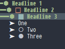

# Table of Contents

1.  [mainspring-org-prettify](#orgfd52790)
    1.  [Overview](#org9e98a4b)
    2.  [Installation](#org510e513)

# mainspring-org-prettify

Substitute characters in org mode for prettier alternatives.

## Overview

mainspring-org-prettify can substitute a wide variety of characters in org documents for prettier alternatives. These are:

-   Headline stars
-   TODO
-   DONE
-   Unchecked checkbox
-   Checked checkbox
-   Plain list bullet

Its killer feature is the pretty headline stars replacement still has a meaningful level indicator.

## Installation

This uses PragmataPro fonts which are non-free. Once the fonts are installed it can be installed with straight like:

    (use-package mainspring-org-prettify
      :defer t
      :straight (:type git :host github :repo "JonathanHope/mainspring-org-prettify" :branch "master" :files ("mainspring-org-prettify.el"))

      :commands (mainspring-org-prettify-mode)

      :init
      (add-hook 'org-mode-hook 'mainspring-org-prettify-mode))
